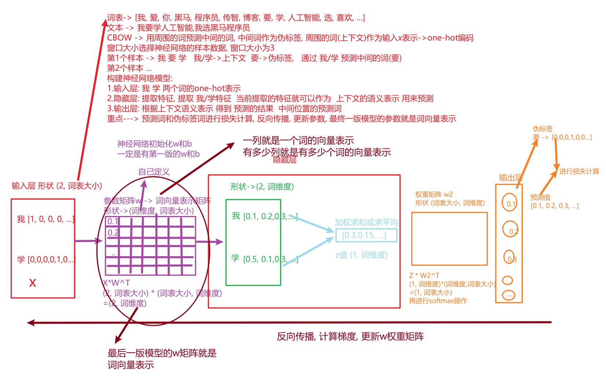
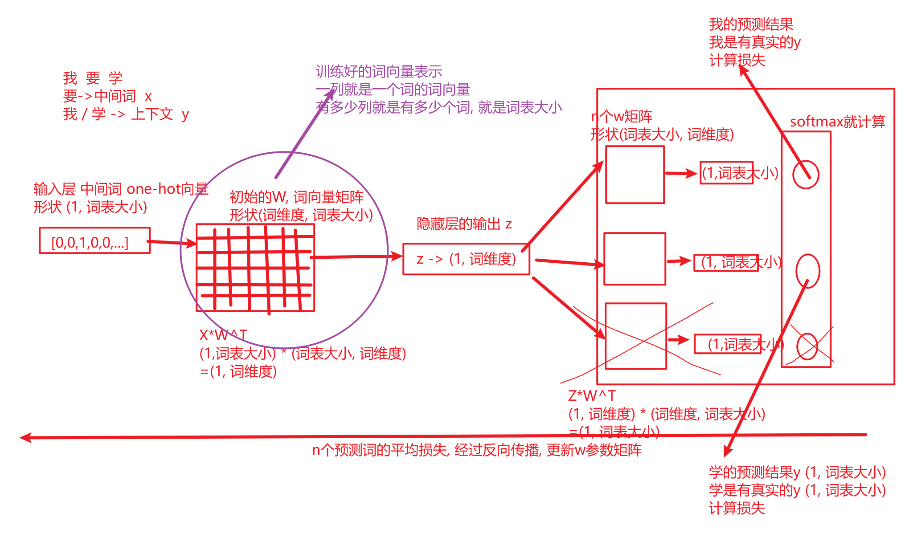
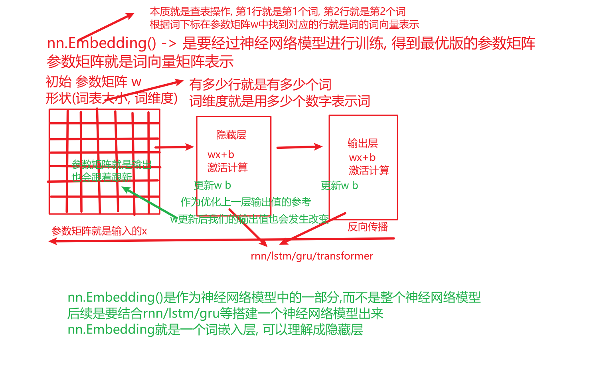

# day02_笔记

## 1 one-hot编码

- 概念

    - 将文本转换成二进制向量表示
    - 词向量的维度数=词表的大小, 词表越大,词维度越高
    - 对应词的位置用1表示, 其他位置都用0表示

- 特征

    - 容易生成稀疏高维的向量
    - 不容易捕获语义

    ```python
    # 导入keras中的词汇映射器Tokenizer
    from tensorflow.keras.preprocessing.text import Tokenizer
    # 导入用于对象保存与加载的joblib
    import joblib
    
    def one_hot_vector():
        # todo:1- 初始化词表
        vocabs = ["周杰伦", "陈奕迅", "王力宏", "李宗盛", "吴亦凡", "鹿晗"]
    
        # todo:2- 实例化tokenizer对象, 分词器对象
        tokenizer = Tokenizer()
        print('tokenizer--->', tokenizer)
        # 构建词表, 词和词下标索引之间的映射关系
        tokenizer.fit_on_texts(texts=vocabs)
        print('tokenizer.word2index--->', tokenizer.word_index)
        print('tokenizer.index2word--->', tokenizer.index_word)
    
        # todo:3-构建one-hot词向量表示
        # one_hot_vector = tokenizer.texts_to_matrix(texts=vocabs, mode='binary')
        one_hot_vector = tokenizer.texts_to_matrix(texts=vocabs, mode='binary')[:, 1:]
        print('one_hot_vector--->', one_hot_vector)
    
        # todo:4-将词和one-hot词向量进行对应
        for word, vector in zip(vocabs, one_hot_vector):
            result = vector.astype(int).tolist()
            print(word, result)
    
        # todo:4-存储分词器对象的结果
        joblib.dump(tokenizer, './onehot_tokenizer.joblib')
    
        # todo:5-加载分词器对象, 进行one-hot转换
        tokenizer = joblib.load('./onehot_tokenizer.joblib')
        result = tokenizer.texts_to_matrix(texts=['王力宏'], mode='binary')[0, 1:]
        print('result--->', result)
    
    
    if __name__ == '__main__':
        one_hot_vector()
    ```


## 2 word2vec模型

- CBOW模式

    - 上下文预测中间的词
    - 上下文作为x
    - 中间的词作为y -> 真实y
    - 模型会得到预测y
    - 真实y和预测要计算损失, 然后反向传播, 更新参数

    

- skipgram

    - 根据中间的词预测上下文
    - 中间词作为x
    - 上下文作为y

    

## 3 embedding词嵌入层

- 是神经网络模型中的一层结构, 不是一个神经网络模型

- 是将文本的词下标索引转换成词向量表示, 词下标映射的就是对应词(查表)

- eg:

    - 我 爱 你 他-> 下标 0, 1, 2, 3
    - 0, 1, 2, 3 -> 向量表示 [1,2,3] [4,5,6] [7,8,9] [10,11,12]
    - 我->0->[1,2,3] 爱->1->[4,5,6] 你->2->[7,8,9] 他->[10,11,12]
    - 我爱你我爱他->[[1,2,3],[4,5,6],[7,8,9],[1,2,3],[4,5,6],[10,11,12]]

    

```python
import torch
import torch.nn as nn
import jieba


# todo:1-初始化文本
text = "我爱自然语言处理, 我爱看足球"

# todo:2-实例化embedding层对象
# num_embeddings: 词表大小, 词表中有多少个词, 当前就设置多少
# embedding_dim: 词向量的维度数, 自定义, 10, 20, 100
embedding = nn.Embedding(num_embeddings=1000, embedding_dim=5)
print('embedding--->', embedding)

# todo:3-使用embedding层进行文本向量化
word_list = jieba.lcut(text)
print('word_list--->', word_list)
# 获取词对应的词下标
word_index = [word_list.index(word) for word in word_list]
print('word_index--->', word_index)
# 将词下标列表转换成张量对象
word_index_tensor = torch.tensor(word_index)
print('word_index_tensor--->', word_index_tensor)
# 调用embedding层对象进行向量化
result = embedding(word_index_tensor)
print('result--->', result.shape, result)

```


